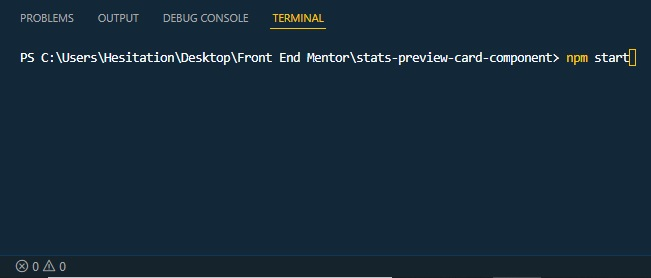
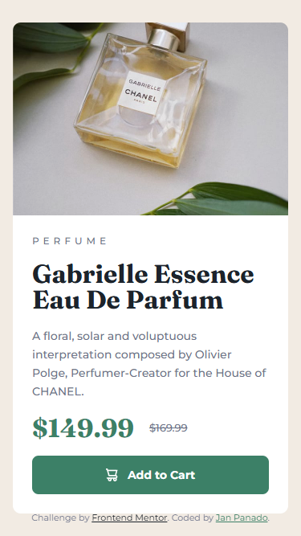
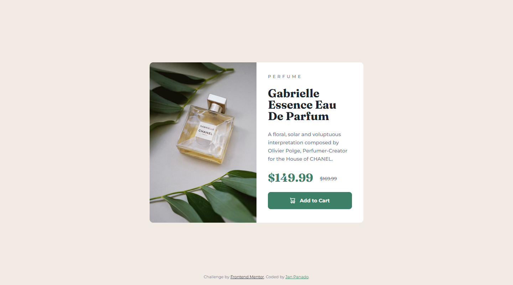

# Frontend Mentor - Product preview card component solution

This is a solution to the  [Product preview card component challenge on Frontend Mentor](https://www.frontendmentor.io/challenges/product-preview-card-component-GO7UmttRfa). Frontend Mentor challenges help you improve your coding skills by building realistic projects.

The root directory here displays the final compiled output, to use the source files for its SASS functions, use the ```source``` folder as your root directory and requires the setup below.

## Setup

Using this solution with SASS requires that you install [Nodejs](https://nodejs.org/en/) to run node packet manager ```npm``` in the command line, if you don't have it yet download from the link above and install it. 

After that, you can now initialize the project using the command line or the build-in VScode command line using ```ctrl + ` ``` then running the ```npm install``` command. 

Then run the ```npm start``` command to start development.  

If you are finished with the project, you can also use the ```npm run postbuild``` script to have your css be run through autoprefixer for browser compatibility and minify it at the same time. 

## Table of contents

- [Overview](#overview)
  - [The challenge](#the-challenge)
  - [Screenshot](#screenshot)
  - [Links](#links)
- [My process](#my-process)
  - [Built with](#built-with)
  - [What I learned](#what-i-learned)
  - [Continued development](#continued-development)
  - [Useful resources](#useful-resources)
- [Author](#author)
- [Acknowledgments](#acknowledgments)

## Overview

### The Challenge

Users should be able to:

- Ensure content is responsive and meets WCAG requirements by testing the full range of screen sizes from 320px to large screens
- View the optimal layout depending on their device's screen size
- See hover and focus states for interactive elements

The designs were created to the following widths:

- Extra Small: 320px
- Mobile: 375px
- Desktop: 1440px

### Screenshot

|  |  |  |
| ------- | ------- | -              |
| Mobile  | Desktop | Desktop Active |

### Links

- Solution URL: [Github Repo](https://github.com/Negligence/product-preview-card)
- Live Site URL: [Github Pages](https://negligence.github.io/product-preview-card/)

## My process

### Built with

- SASS
- [Nodejs](https://nodejs.org/en/)
- Semantic HTML5 markup
- CSS custom properties
- CSS Grid
- Mobile-first workflow

### What I learned

I learned to tweak and rename the design containers in figma to make it easier to translate it to html code structure.

```html
<article class="card grid">

  <div class="card-img">
    
    
  </div>

  <div class="card-content grid">

    <span class="category text-overline">Perfume</span>
    
    <h1 class="title text-display">Gabrielle Essence Eau De Parfum</h1>
    
    <p class="description text-body">
      A floral, solar and voluptuous interpretation composed by Olivier Polge,
      Perfumer-Creator for the House of CHANEL.
    </p>
    
    <div class="price grid">
      <span class="price-new text-display">$149.99</span>
      <span class="price-old">$169.99</span>
    </div>
    
    <button class="button text-button">
      
      Add to Cart
    </button>
    
  </div>
  
</article>
```

I also found it handy to create classes based on the figma design local styles.

```scss
html {
  box-sizing: border-box;
  scroll-behavior: smooth;
  height: 100%;
  width: 100%;

  --white: hsl(0, 0%, 100%);
  --cream: hsl(30, 38%, 92%);
  --aurometal-saurus: hsl(228, 12%, 48%);
  --deep-aquamarine: hsl(158, 36%, 37%);
  --deep-aquamarine-hover: hsl(157, 43%, 18%);
  --gunmetal: hsl(212, 21%, 14%);

  --ff-head: "Fraunces", serif;
  --ff-body: "Montserrat", sans-serif;

  --fz-1: calc(32 / 16 * 1rem);
  --fz-2: calc(14 / 16 * 1rem);
  --fz-3: calc(12 / 16 * 1rem);

  --s-500: calc(40 / 16 * 1rem);
  --s-300: calc(24 / 16 * 1rem);
  --s-200: calc(16 / 16 * 1rem);
  --s-150: calc(12 / 16 * 1rem);
  --s-100: calc(8 / 16 * 1rem);
  --s-50: calc(4 / 16 * 1rem);
}

.text-display {
  font-family: var(--ff-head);
  font-size: var(--fz-1);
  font-weight: 700;
  line-height: 1em;
}

.text-body {
  font-size: var(--fz-2);
  font-weight: 500;
  line-height: em(23px, 14px);
}

.text-button {
  font-family: var(--ff-body);
  font-size: var(--fz-2);
  font-weight: 700;
  line-height: auto;
}

.text-overline {
  font-size: var(--fz-3);
  font-weight: 500;
  line-height: auto;
  letter-spacing: rem(5px);
  text-transform: uppercase;
}
```

### Continued development

These functions will be very helpful moving forward with future projects.

```clamped()```

Takes 2 arguments -- Minimum Pixel Value, Maximum Pixel Value and will compute the middle value aswell as converting them to Rem values.

```css
p {
  font-size: clamped(16px, 19px);
}
```

```css
p {
  font-size: clamp(1rem, 0.5vw + 0.88rem, 1.19rem);
}
```

```rem()```

Takes the pixel value and divides it by 16 (which is the default browser font size) then returns it in Rems.

```css
strong {
      font-size: rem(24px);
    }
```
```css
section > .stats strong {
  font-size: 1.5rem;
}
```

```em()```

Takes the pixel value and divides it by 16 (which is the default browser font size) then returns it in Ems. If its parent container has a different font size, it can take in another value to replace the default 16 that you divide by.

```css
h1 {
  line-height: em(44px, 36px);
}
```
```css
h1 {
  line-height: 1.2222222222em;
}
```

Mixins that use ```@include```

The following mixins create media queries for mobile first and desktop first approaches.
They take in a pixel values as an argument then converts it to em values.

```mobile-media-query()```

```css
@include mobile-media-query(1440px) {

}
```
```css
@media only screen and (min-width: 90em) {

}
```

```desktop-media-query()```

```css
@include desktop-media-query(374px) {

}
```
```css
@media only screen and (max-width: 23.375em) {

}
```

### Useful resources

- [Fluid Type Scale Calculator](https://utopia.fyi/type/calculator), [Neko Calc Px to Rem Converter](https://nekocalc.com/px-to-rem-converter), and [Neko Calc Px to Em Converter](https://nekocalc.com/px-to-em-converter) - These are the originals that I drew inspiration from and used before when I didn't know how to use SASS.
- [Creating a Fluid Type Scale with CSS Clamp](https://www.aleksandrhovhannisyan.com/blog/fluid-type-scale-with-css-clamp/) - An article that explains how the fluid type scale calculator computes the preferred size for clamps. This is also the source that I used to create my modified _functions.scss
- [Stop using an extension to compile Sass](https://www.youtube.com/watch?v=o4cECvhrBo8) - Video that taught me how to get a simple SASS setup up and running and is the base for my modified package.json setup file.
- [Stop using @import with Sass | @use and @forward explained](https://www.youtube.com/watch?v=CR-a8upNjJ0) - Gave me a glimpse of how to connect SASS files to each other.
- [Write less code with these Sass mixins](https://www.youtube.com/watch?v=7ruDsUN4-iA) - My Main inspiration to create my on Mixins.
- [3 custom property tricks to improve your CSS](https://www.youtube.com/watch?v=pKWSXyilG9k) and [The one big problem with custom properties (and how to get around it)](https://www.youtube.com/watch?v=CVCHrxzNNDc) - These are the two videos that convinced me to opt for CSS custom properties over SASS variables, and in turn forced me to learn about SASS interpolation.
- [5 Sass features that make it better than vanilla CSS](https://www.youtube.com/watch?v=g1kF45K-q7o) - Gave me a brief overview of what I can do with SASS and made me try to incorporate as much functionality as I can to simplify future works.

- [Sass with auto-refresh (and more) made easy](https://www.youtube.com/watch?v=wYWf2m_yzBQ), [Sass, BEM, & Responsive Design (4 hr beginners course)](https://www.youtube.com/watch?v=jfMHA8SqUL4), [Sass @import is being replaced with @use and @forward](https://www.youtube.com/watch?v=dOnYNEXv9BM), [Generate custom props & utility classes with Sass?!](https://www.youtube.com/watch?v=gP8yFWCTr7Q) - More SASS Videos I binge-watched to further understand the fuck that I was doing.

## Author

- Frontend Mentor - [@Negligence](https://www.frontendmentor.io/profile/Negligence)
- Github - [Negligence](https://github.com/Negligence)
- Twitter - [@IEImNothing](https://twitter.com/IEImNothing)
- Twitch - [Arrogant_Negligence](https://www.twitch.tv/arrogant_negligence)
- Youtube - [Jan Panado](https://www.youtube.com/channel/UC4ojhHYmkHptu2JpyKtrL-w)
- LinkedIn - [Jan Panado](https://www.linkedin.com/in/janp-09/)
- Facebook - [Jan Panado](https://www.facebook.com/jan.panado)
- Website - [Jan Panado](https://janpanado.com/)

## Acknowledgments

Shout out to [Kevin Powell](https://www.youtube.com/kepowob) and [Coder Coder](https://www.youtube.com/c/TheCoderCoder), their videos have been a Huge **HUGE** help. I really don't know what I would've done without their resources helping me out.
